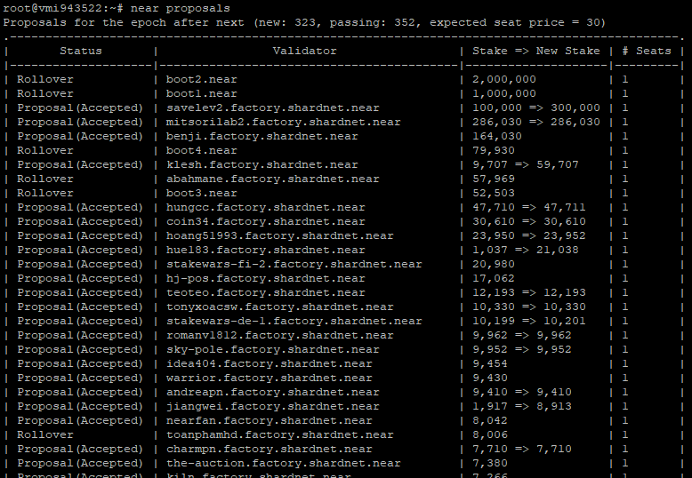

# Shardnet wallet

<table>
<tr>
    <td align='center'><b>Action</b></td>
    <td align='center'><b>Image</b></td>
</tr>
<tr>
    <td>
		1. Go to <a href="https://wallet.shardnet.near.org/">https://wallet.shardnet.near.org/</a> and choose <b>Create Account</b>.
		<p>
			If you have an account choose <b>Import Existing Account</b> and go to Item #6
		</p>
	</td>
    <td>
		
	</td>
</tr>
<tr>
    <td>
		2. Choose unique account ID and click <b>Reserve My Account ID</b>
	</td>
    <td>
		
	</td>
</tr>
<tr>
    <td>
		3. Choose Secure Passphrase as the most secured and the easyest to use. Push <b>Continue</b>
	</td>
    <td>
		
	</td>
</tr>
<tr>
    <td>
		4. Save the phrase. Copy it and push <b>Continue</b>
	</td>
    <td>
		
	</td>
</tr>
<tr>
    <td>
		5. Approve saving passphrase by entering some word whitch wallet ask you and press <b>Verify & Complete</b>
	</td>
    <td>
		
	</td>
</tr>
<tr>
    <td>
		6. Then paste your pathphrase to field <b>Find My Account</b>
	</td>
    <td>
		
	</td>
</tr>
<tr>
    <td>
		7. If everything is ok you may see your balance
	</td>
    <td>
		
	</td>
</tr>
</table>

# VPS choice

Logically, VPS description has to be here (before next step) but it's topic of the **[Challenge 005](./challenge_005.md)**.

# Deployment NEAR CLI

```bash
# Update repositories and packages
sudo apt update && sudo apt upgrade -y

# Install Node.js and npm
curl -sL https://deb.nodesource.com/setup_18.x | sudo -E bash -
sudo apt install build-essential nodejs
PATH="$PATH"
```

```bash
# Check Node and npm versions
node -v
> v18.6.0

npm -v
> 8.13.2
```

```bash
# Install NEAR-CLI
sudo npm install -g near-cli

# Check NEAR-CLI version
near --version
> 3.4.0
```

### Set Shardnet as persistent environment

```bash
export NEAR_ENV=shardnet
echo 'export NEAR_ENV=shardnet' >> ~/.bashrc
```

## NEAR CLI Commands

### Proposals

A proposal by a validator indicates they would like to enter the validator set, in order for a proposal to be accepted it must meet the minimum seat price.

Command:
```
near proposals
```



### Validators Current

This shows a list of active validators in the current epoch, the number of blocks produced, number of blocks expected, and online rate. Used to monitor if a validator is having issues.

Command:

```
near validators current
```


### Validators Next

This shows validators whose proposal was accepted one epoch ago, and that will enter the validator set in the next epoch.

Command:

```
near validators next
```
