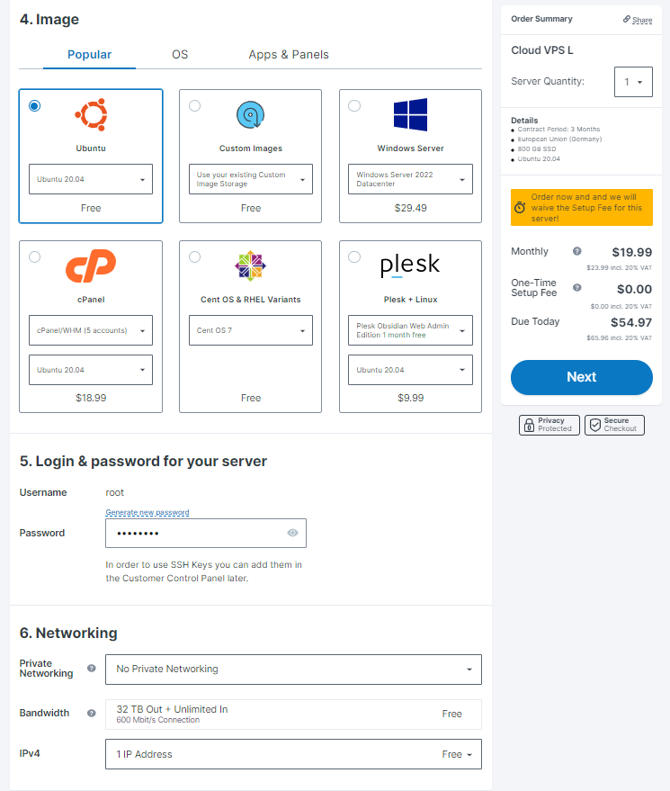

# Shardnet wallet

<table>
<tr>
    <td align='center'><b>Action</b></td>
    <td align='center'><b>Image</b></td>
</tr>
<tr>
    <td>
		1. Go to <a href="https://wallet.shardnet.near.org/">https://wallet.shardnet.near.org/</a> and choose <btn>Create Account</btn>.
		

			If you have an account choose <btn>Import Existing Account</btn> and go to Item #6
		

	</td>
    <td>
		
	</td>
</tr>
<tr>
    <td>
		2. Choose unique account ID and click 
<btn>Reserve My Account ID</btn>
	</td>
    <td>
		
	</td>
</tr>
<tr>
    <td>
		3. Choose Secure Passphrase as the most secured and the easyest to use. Push <btn>Continue</btn>
	</td>
    <td>
		
	</td>
</tr>
<tr>
    <td>
		4. Save the phrase. Copy it and push <btn>Continue</btn>
	</td>
    <td>
		
	</td>
</tr>
<tr>
    <td>
		5. Approve saving passphrase by entering some word whitch wallet ask you and press <btn>Verify & Complete</btn>
	</td>
    <td>
		
	</td>
</tr>
<tr>
    <td>
		6. Then paste your pathphrase to field <btn>Find My Account</btn>
	</td>
    <td>
		
	</td>
</tr>
<tr>
    <td>
		7. If everything is ok you may see your balance
	</td>
    <td>
		
	</td>
</tr>
</table>

# VPS choice

The best VPS offer I have found is <a href='https://contabo.com/en/vps/'>Contabo</a>

Suitable solution for my requirements is CLOUD VPS L and it's quite powerfull than recommended  requirements

| Hardware       | Chunk-Only Producer  Specifications   | Contabo CLOUD VPS L  |
| -------------- | ------------------------------------  | -------------------- |
| CPU            | 4-Core CPU with AVX support           |	8 vCPU				|
| RAM            | 8GB DDR4                              |	30 GB				|
| Storage        | 500GB SSD                             |	800GB SSD			|

## My configure below

 
 

# Deployment the NEAR CLI
