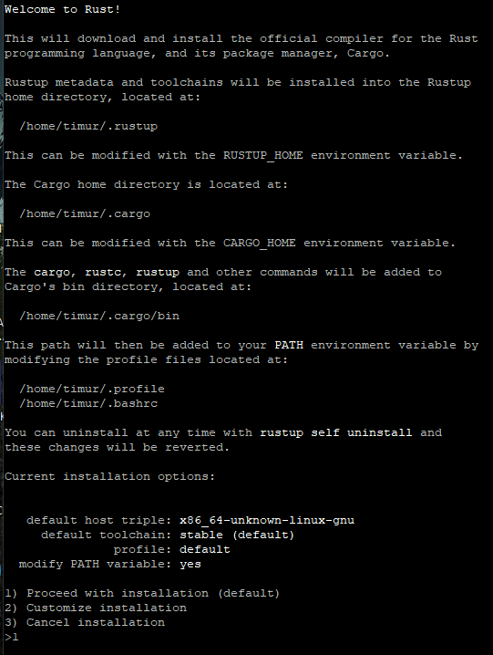
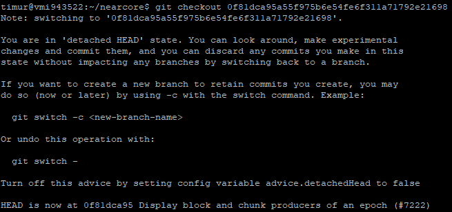
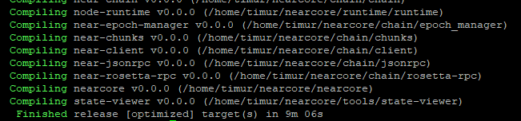
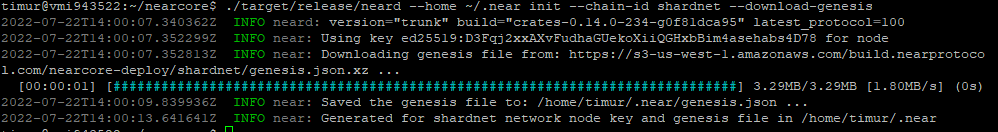
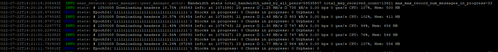
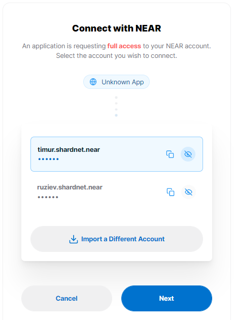
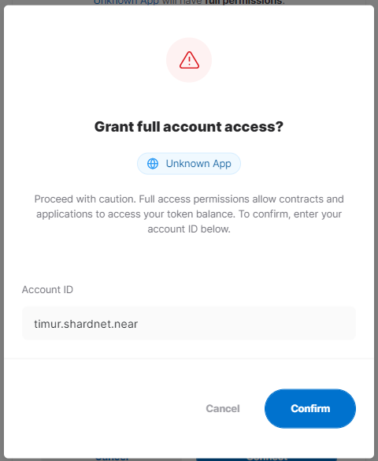
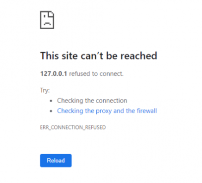
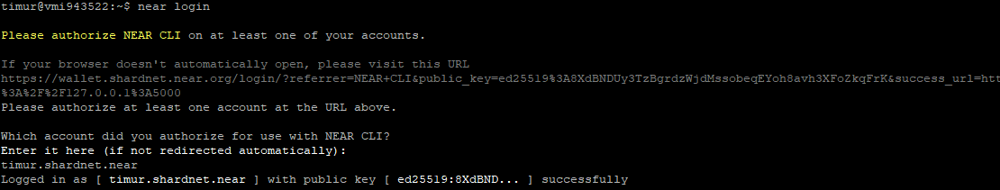
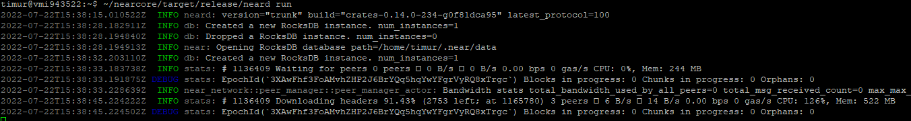

# Deployment a node

## Install tools

### Let's check the right CPU features

```bash
lscpu | grep -P '(?=.*avx )(?=.*sse4.2 )(?=.*cx16 )(?=.*popcnt )' > /dev/null \
  && echo "Supported" \
  || echo "Not supported"

> Supported
```

### Install developer tools:

```bash
sudo apt install -y git binutils-dev libcurl4-openssl-dev zlib1g-dev libdw-dev libiberty-dev cmake gcc g++ python docker.io protobuf-compiler libssl-dev pkg-config clang llvm cargo
```

### Install Python pip:

```bash
sudo apt install python3-pip -y
```

### Set the configuration:

```bash
USER_BASE_BIN=$(python3 -m site --user-base)/bin
export PATH="$USER_BASE_BIN:$PATH"
```

### Install Building env:

```bash
sudo apt install clang build-essential make
```

### Install Rust & Cargo:

```bash
curl --proto '=https' --tlsv1.2 -sSf https://sh.rustup.rs | sh
```



Press 1 and press enter. Wait some time and see:

```bash
Rust is installed now. Great!
```

### Source the environment

```bash
source $HOME/.cargo/env
```

## Build nearcore

### First, clone the [nearcore repository](https://github.com/near/nearcore)

```bash
git clone https://github.com/near/nearcore
> Cloning into 'nearcore'...
> remote: Enumerating objects: 98650, done.
> remote: Counting objects: 100% (535/535), done.
> remote: Compressing objects: 100% (264/264), done.
> remote: Total 98650 (delta 303), reused 443 (delta 270), pack-reused 98115
> Receiving objects: 100% (98650/98650), 102.49 MiB | 13.83 MiB/s, done.
> Resolving deltas: 100% (67773/67773), done.

cd nearcore/
```

### Checkout to the commit needed

```bash
git checkout 0f81dca95a55f975b6e54fe6f311a71792e21698
```



<details>
  <summary>❗ ACTUAL COMMIT</summary>

### You can find actual commit in [Discord community](https://discord.com/channels/490367152054992913/991851497002381363/999977041178918942)

</details>

### Compile nearcore binary:

```bash
cargo build -p neard --release --features shardnet
```

After some minutes we will get:


### Check version:

```bash
./target/release/neard -V
neard (release trunk) (build crates-0.14.0-234-g0f81dca95) (rustc 1.62.0) (protocol 100) (db 31)
```

### Initialize working directory:

```bash
./target/release/neard --home ~/.near init --chain-id shardnet --download-genesis
```



This command will create the directory structure and will generate `config.json`, `node_key.json`, and `genesis.json` on the network you have passed.

- `config.json` - Configuration parameters which are responsive for how the node will work. The config.json contains needed information for a node to run on the network, how to communicate with peers, and how to reach consensus. Although some options are configurable. In general validators have opted to use the default config.json provided.

- `genesis.json` - A file with all the data the network started with at genesis. This contains initial accounts, contracts, access keys, and other records which represents the initial state of the blockchain. The genesis.json file is a snapshot of the network state at a point in time. In contacts accounts, balances, active validators, and other information about the network.

- `node_key.json` - A file which contains a public and private key for the node. Also includes an optional `account_id` parameter which is required to run a validator node (not covered in this doc).

- `data/` - A folder in which a NEAR node will write it's state.

### Replace the `config.json`

From the generated `config.json`, there two parameters to modify:

- `boot_nodes`: If you had not specify the boot nodes to use during init in Step 3, the generated `config.json` shows an empty array, so we will need to replace it with a full one specifying the boot nodes.
- `tracked_shards`: In the generated `config.json`, this field is an empty. You will have to replace it to `"tracked_shards": [0]`

```bash
rm ~/.near/config.json
wget -O ~/.near/config.json https://s3-us-west-1.amazonaws.com/build.nearprotocol.com/nearcore-deploy/shardnet/config.json
```

# Downloading a snapshot

#### Run the node

To start your node simply run the following command:

```
cd ~/nearcore
./target/release/neard --home ~/.near run
```


The node is now running you can see log outputs in your console. Your node should be find peers, download headers to 100%, and then download blocks.

# Activating the node as validator

## Authorize Wallet Locally

A full access key needs to be installed locally to be able to sign transactions via NEAR-CLI.

You need to run this command:

```bash
near login
```

> Note: This command launches a web browser allowing for the authorization of a full access key to be copied locally.

|     | Step                                                           | Picture                                       |
| --- | -------------------------------------------------------------- | --------------------------------------------- |
| 1   | Copy the link in your browser                                  |             |
| 2   | Grant Access to Near CLI                                       |            |
| 3   | After Grant, you will see a page like this, go back to console |  |
| 4   | Enter your wallet and press Enter                              |              |

## Generate validator key

### Check the validator_key.json

```
cat ~/.near/validator_key.json
```

> Note: If a validator_key.json is not present, you have to create it

### Generate the Key file:

```bash
near generate-key timur.factory.shardnet.near
# where timur.factory.shardnet.near - my shardnet pool ID
```

### Copy the file generated to shardnet folder:

```
cp ~/.near-credentials/shardnet/timur.shardnet.near.json ~/.near/validator_key.json
```

- Edit `account_id`: timur.shardnet.near => timur.factory.shardnet.near
- Change `private_key` to `secret_key`

```json
/* before editing*/
{
	"account_id":"timur.shardnet.near",
	"public_key":"ed25519:8XdBNDUy3TzBgrdzWjdMssobeqEYoh8avh3XFoZkqFrK",
	"private_key":"ed25519:**"
}
/* after editing*/
{
	"account_id":"timur.factory.shardnet.near",
	"secret_key":"ed25519:8XdBNDUy3TzBgrdzWjdMssobeqEYoh8avh3XFoZkqFrK",
	"private_key":"ed25519:**"
}
```

### Start the validator node

```bash
~/nearcore/target/release/neard run
```



# Setting neard as system service

### Create file `neard.service`

```bash
sudo nano /etc/systemd/system/neard.service
```

Paste:

```bash
[Unit]
Description=NEARd Daemon Service
[Service]
Type=simple
User=timur
#Group=near
WorkingDirectory=/home/timur/.near
ExecStart=/home/timur/nearcore/target/release/neard run
Restart=on-failure
RestartSec=30
KillSignal=SIGINT
TimeoutStopSec=45
KillMode=mixed
[Install]
WantedBy=multi-user.target
```

Command:

```bash
sudo systemctl enable neard
```

Command:

```bash
sudo systemctl start neard
```

If you need to make a change to service because of an error in the file. It has to be reloaded:

```bash
sudo systemctl reload neard
```

### Watch logs

```bash
# allow user to watch system journal
sudo usermod -a -G systemd-journal timur
# restart terminal
```

```bash
journalctl -n 100 -f -u neard -q
```

Make log output in pretty print

```bash
sudo apt install ccze
```

View Logs with color

```bash
journalctl -n 100 -f -u neard | ccze -A
```
