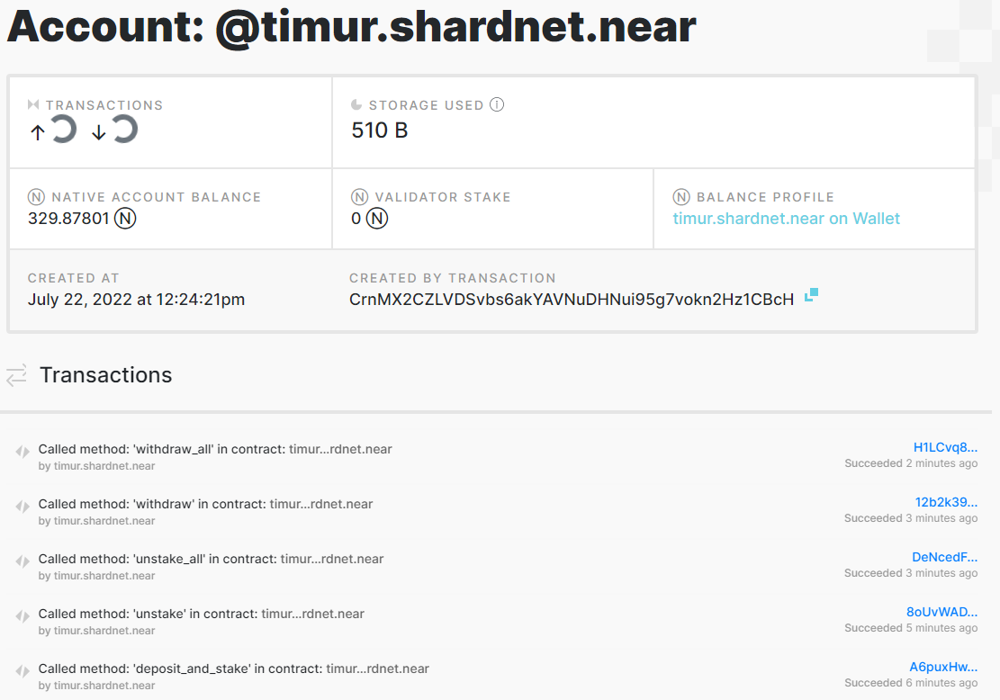

# Mounting a staking pool

## Deploy a Staking Pool Contract

Deploy a Staking Pool
Calls the staking pool factory, creates a new staking pool with the specified name, and deploys it to the indicated accountId.
Command template:

```bash
# near call factory.shardnet.near create_staking_pool '{"staking_pool_id": "<pool id>", "owner_id": "<accountId>", "stake_public_key": "<public key>", "reward_fee_fraction": {"numerator": 5, "denominator": 100}, "code_hash":"DD428g9eqLL8fWUxv8QSpVFzyHi1Qd16P8ephYCTmMSZ"}' --accountId="<accountId>" --amount=30 --gas=300000000000000
```

From the example above, you need to replace:

- **Pool ID**: Staking pool name, the factory automatically adds its name to this parameter, creating {pool_id}.{staking_pool_factory}
  Examples:

* If pool id is stakewars will create : `stakewars.factory.shardnet.near`

- **Owner ID**: The SHARDNET account (i.e. stakewares.shardnet.near) that will manage the staking pool.
- **Public Key**: The public key in your **validator_key.json** file.
- **5**: The fee the pool will charge (e.g. in this case 5 over 100 is 5% of fees).
- **Account Id**: The SHARDNET account deploying and signing the mount tx. Usually the same as the Owner ID.

My command:

```bash
near call factory.shardnet.near create_staking_pool '{"staking_pool_id": "timur", "owner_id": "timur.shardnet.near", "stake_public_key": "ed25519:8XdBNDUy3TzBgrdzWjdMssobeqEYoh8avh3XFoZkqFrK", "reward_fee_fraction": {"numerator": 5, "denominator": 100}, "code_hash":"DD428g9eqLL8fWUxv8QSpVFzyHi1Qd16P8ephYCTmMSZ"}' --accountId="timur.shardnet.near" --amount=30 --gas=300000000000000
```


## 🥳 We made it! Staking pool has been created!


To change the pool parameters, such as changing the amount of commission charged to 3% in the example below, use this command:

```bash
# near call <pool_name> update_reward_fee_fraction '{"reward_fee_fraction": {"numerator": 3, "denominator": 100}}' --accountId <account_id> --gas=300000000000000
```

```bash
near call timur.factory.shardnet.near update_reward_fee_fraction '{"reward_fee_fraction": {"numerator": 3, "denominator": 100}}' --accountId timur.shardnet.near --gas=300000000000000
```

# Transactions Guide

### Deposit and Stake NEAR

```bash
near call timur.factory.shardnet.near deposit_and_stake --amount 200 --accountId timur.shardnet.near --gas=300000000000000
```

### Unstake NEAR

Amount in yoctoNEAR.

```bash
near call timur.factory.shardnet.near unstake '{"amount": "5000000000000000000"}' --accountId timur.shardnet.near --gas=300000000000000
```

To unstake all you can run this one:

```bash
near call timur.factory.shardnet.near unstake_all --accountId timur.shardnet.near --gas=300000000000000
```

### Withdraw

Unstaking takes 2-3 epochs to complete, after that period you can withdraw in YoctoNEAR from pool.

```bash
near call timur.factory.shardnet.near withdraw '{"amount": "5000000000000000000"}' --accountId timur.shardnet.near --gas=300000000000000
```

Command to withdraw all:

```bash
near call timur.factory.shardnet.near withdraw_all --accountId timur.shardnet.near --gas=300000000000000
```

### We can see our smart-contract calls in [**Explorer**](https://explorer.shardnet.near.org/accounts/timur.shardnet.near)



## Ping

A ping issues a new proposal and updates the staking balances for your delegators. A ping should be issued each epoch to keep reported rewards current.

```bash
near call timur.factory.shardnet.near ping '{}' --accountId timur.shardnet.near --gas=300000000000000
```

## Balances

### Total Balance

```bash
near view timur.factory.shardnet.near get_account_total_balance '{"account_id": "timur.shardnet.near"}'

# response
> View call: timur.factory.shardnet.near.get_account_total_balance({"account_id": "timur.shardnet.near"})
'450000000000000000000000000'
```

### Staked Balance

```bash
near view timur.factory.shardnet.near get_account_staked_balance '{"account_id": "timur.shardnet.near"}'

# response
View call: timur.factory.shardnet.near.get_account_staked_balance({"account_id": "timur.shardnet.near"})
'250000000000000000000000000'

```

### Unstaked Balance

```bash
near view timur.factory.shardnet.near get_account_unstaked_balance '{"account_id": "timur.shardnet.near"}'

# response
View call: timur.factory.shardnet.near.get_account_unstaked_balance({"account_id": "timur.shardnet.near"})
'200000000000000000000000000'
```

### Available for Withdrawal

You can only withdraw funds from a contract if they are unlocked.

```bash
near view timur.factory.shardnet.near is_account_unstaked_balance_available '{"account_id": "timur.shardnet.near"}'

# response
View call: timur.factory.shardnet.near.is_account_unstaked_balance_available({"account_id": "timur.shardnet.near"})
false
```

## Pause / Resume Staking

### Pause

Command:

```bash
near call timur.factory.shardnet.near pause_staking '{}' --accountId timur.shardnet.near

# response
Scheduling a call: timur.factory.shardnet.near.pause_staking({})
Doing account.functionCall()
Retrying request to broadcast_tx_commit as it has timed out [
  'EwAAAHRpbXVyLnNoYXJkbmV0Lm5lYXIAb9oj4e7kWG0Pr24lQPi2279kIVBulRLmNgb2URlezNTNShCnDwEAABsAAAB0aW11ci5mYWN0b3J5LnNoYXJkbmV0Lm5lYXJ6eRqT88qpj6s8QgfjzaXLy84XAaTvAldsUJuCJhrWSQEAAAACDQAAAHBhdXNlX3N0YWtpbmcCAAAAe30A4FfrSBsAAAAAAAAAAAAAAAAAAAAAAAAAb1lCIcrBJs1efCbm3WJ6zTOsLTMpcKQuC+0TUCia6UOG4+hhFVeor/pi+aYtBpZP3VkGFbeKvqNIgVoLA7UICw=='
]
Transaction Id 5QUprFdR2nTNEdv7XQUUNn8kmkHzZYiHQ1mYT27G4cqM
To see the transaction in the transaction explorer, please open this url in your browser
https://explorer.shardnet.near.org/transactions/5QUprFdR2nTNEdv7XQUUNn8kmkHzZYiHQ1mYT27G4cqM
''
```

### Resume

Command:

```bash
near call timur.factory.shardnet.near resume_staking '{}' --accountId timur.shardnet.near

# response
Scheduling a call: timur.factory.shardnet.near.resume_staking({})
Doing account.functionCall()
Retrying request to broadcast_tx_commit as it has timed out [
  'EwAAAHRpbXVyLnNoYXJkbmV0Lm5lYXIAb9oj4e7kWG0Pr24lQPi2279kIVBulRLmNgb2URlezNTOShCnDwEAABsAAAB0aW11ci5mYWN0b3J5LnNoYXJkbmV0Lm5lYXIJzWf0JUNnfE7ReIEV6/SoSInvVje22VEkSgzTGZ2CAQEAAAACDgAAAHJlc3VtZV9zdGFraW5nAgAAAHt9AOBX60gbAAAAAAAAAAAAAAAAAAAAAAAAADVoAfqrdW8h18s1Lj5BqALdtcxNUvGNKKbQRT8+5Jz6NA0ROoIYFsPJx+d9pgtmvrWGmPO/3+5hjSsUTKphWww='
]
Transaction Id Gfib7Hrwkvc9jzzawcmSgqVfvXRgP7tyBJvHmnEon5ne
To see the transaction in the transaction explorer, please open this url in your browser
https://explorer.shardnet.near.org/transactions/Gfib7Hrwkvc9jzzawcmSgqVfvXRgP7tyBJvHmnEon5ne
''
```

| [⏮ Challenge 002 ](./challenge_002.md) | [Challenge 004 ⏭](./challenge_004.md) |
| -------------------------------------- | ------------------------------------- |
