# Getting useful information from node by RPC on port 3030

## Install tools

```bash
sudo apt install curl jq
```

## Common Commands:

### Check your node version:

```bash
curl -s http://127.0.0.1:3030/status | jq .version

# response
{
  "version": "trunk",
  "build": "crates-0.14.0-234-g0f81dca95",
  "rustc_version": "1.62.0"
}
```

### Check Delegators and Stake

```bash
near view timur.factory.shardnet.near get_accounts '{"from_index": 0, "limit": 10}' --accountId timur.shardnet.near

# response
View call: timur.factory.shardnet.near.get_accounts({"from_index": 0, "limit": 10})
[
  {
    account_id: 'timur.shardnet.near',
    unstaked_balance: '200000000000000000000000000',
    staked_balance: '250005707377335497912998823',
    can_withdraw: false
  },
  {
    account_id: '0000000000000000000000000000000000000000000000000000000000000000',
    unstaked_balance: '0',
    staked_balance: '2723201909581499999999',
    can_withdraw: true
  }
]
```

### Check Reason Validator Kicked

```bash
curl -s -d '{"jsonrpc": "2.0", "method": "validators", "id": "dontcare", "params": [null]}' -H 'Content-Type: application/json' 127.0.0.1:3030 | jq -c '.result.prev_epoch_kickout[] | select(.account_id | contains ("boot1.near"))' | jq .reason

# result
{
  "NotEnoughBlocks": {
    "expected": 10871,
    "produced": 8329
  }
}
```

### Check Blocks Produced / Expected

```bash
curl -s -d '{"jsonrpc": "2.0", "method": "validators", "id": "dontcare", "params": [null]}' -H 'Content-Type: application/json' 127.0.0.1:3030 | jq -c '.result.current_validators[] | select(.account_id | contains ("boot1.near"))' | jq

# result
{
  "account_id": "boot1.near",
  "is_slashed": false,
  "num_expected_blocks": 414,
  "num_expected_chunks": 1268,
  "num_produced_blocks": 414,
  "num_produced_chunks": 1252,
  "public_key": "ed25519:AHhWwLjDc9ohGmxACaFWUdBw1CSaubTyPU5YmnUD2DmP",
  "shards": [
    0
  ],
  "stake": "530000000000000000000000000000"
}

```

# Node monitoring

### Run node_exporter

```bash
sudo docker run -dit \
    --restart always \
    --volume /proc:/host/proc:ro \
    --volume /sys:/host/sys:ro \
    --volume /:/rootfs:ro \
    --name node-exporter \
    -p 9100:9100 prom/node-exporter:latest \
    --path.procfs=/host/proc \
    --path.sysfs=/host/sys

```

### Build near-prometeus

```bash
git clone https://github.com/masknetgoal634/near-prometheus-exporter

cd near-prometheus-exporter

sudo docker build -t near-prometheus-exporter .

```

### Run container

```bash
sudo docker run -dit \
    --restart always \
    --name near-exporter \
    --network=host \
    -p 9333:9333 \
    near-prometheus-exporter:latest /dist/main -accountId timur.factory.shardnet.near

```

### Check it:

```bash
sudo docker ps -a

# result
> CONTAINER ID   IMAGE                             COMMAND                  CREATED              STATUS              PORTS                    NAMES
> 5cf38c08b1d1   near-prometheus-exporter:latest   "/dist/main -account…"   16 seconds ago       Up 15 seconds                                near-exporter
> f6106ab585c7   prom/node-exporter:latest         "/bin/node_exporter …"   About a minute ago   Up About a minute   0.0.0.0:9100->9100/tcp   node-exporter
```

### Configure Prometheus

```bash
cd ~/near-prometheus-exporter/etc
nano prometheus/prometheus.yml

# Fill in your node IP in targets

  - job_name: node
    scrape_interval: 5s
    static_configs:
    # - targets: ['<NODE_IP_ADDRESS>:9100']
    - targets: ['38.242.250.37:9100']


  - job_name: near-exporter
    scrape_interval: 15s
    static_configs:
    # - targets: ['<NODE_IP_ADDRESS>:9333']
    - targets: ['38.242.250.37:9333']


  - job_name: near-node
    scrape_interval: 15s
    static_configs:
    # - targets: ['<NODE_IP_ADDRESS>:3030']
    - targets: ['38.242.250.37:3030']

```

### Run Prometheus

```bash
sudo docker run -dti \
    --restart always \
    --volume $(pwd)/prometheus:/etc/prometheus/ \
    --name prometheus \
    -p 9090:9090 prom/prometheus:latest \
    --config.file=/etc/prometheus/prometheus.yml
```

### Run Graffana

```bash

# Check user ID
id -u
1000

# Edit permission
sudo chown -R 1000:1000 grafana/*

sudo docker run -dit \
    --restart always \
    --volume $(pwd)/grafana:/var/lib/grafana \
    --volume $(pwd)/grafana/provisioning:/etc/grafana/provisioning \
    --volume $(pwd)/grafana/custom.ini:/etc/grafana/grafana.ini \
    --user 1000 \
    --name grafana \
    -p 3000:3000 grafana/grafana

```

> ❗ IF YOU CATCH SOME ERROR
>
> go to file grafana/custom.ini
>
> ```bash
> nano ~/near-prometheus-exporter/etc/grafana/custom.ini
>
> #remove or comment rows
> ;user = <your API key>        # <- like this
> ;password = <your secret key> # <- like this
> ;cert_file =
> ;key_file =
> ;from_address = <your_email_address> # <- like this
>
> ```
>
> Then run it agian

```bash
sudo docker ps -a

# result
> CONTAINER ID   IMAGE                             COMMAND                  CREATED              STATUS              PORTS                    NAMES
> 55efc9ce325a   grafana/grafana                   "/run.sh"                About a minute ago   Up About a minute   0.0.0.0:3000->3000/tcp   grafana
> 3431bfb8287b   prom/prometheus:latest            "/bin/prometheus --c…"   3 minutes ago        Up 3 minutes                                 prometheus
> 5cf38c08b1d1   near-prometheus-exporter:latest   "/dist/main -account…"   6 minutes ago        Up 6 minutes                                 near-exporter
> f6106ab585c7   prom/node-exporter:latest         "/bin/node_exporter …"   7 minutes ago        Up 7 minutes        0.0.0.0:9100->9100/tcp   node-exporter

```

### Go to Grafana

### Go to **<'YOUR-HOST-IP'>:3000**, log in with **admin**/**admin**

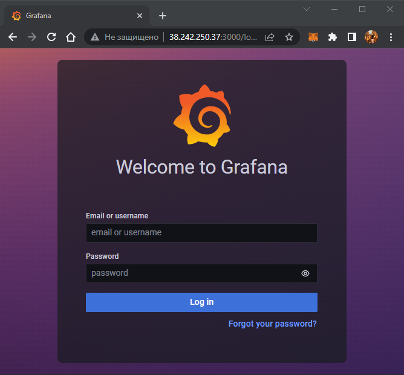

### Create new password

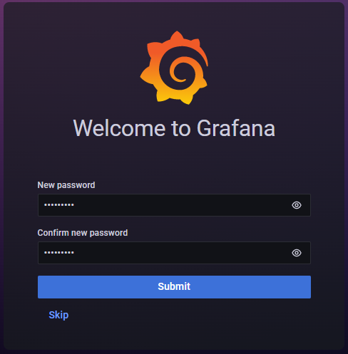

### Go to **Settings** -> **Data Sources** -> **Prometheus**

Click **Save & test** if everythig is ok, go to next step, otherwise change default URL on http://172.17.0.1:9090 and click **Save & test** again. It has to work!

|                                                         | Change URL if there is en error                      |
| ------------------------------------------------------- | ---------------------------------------------------- |
| 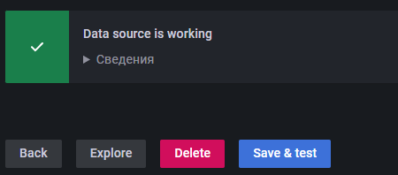 | 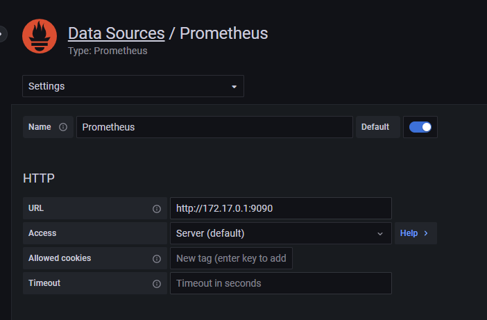 |

### After success source update you can see the great dashboard

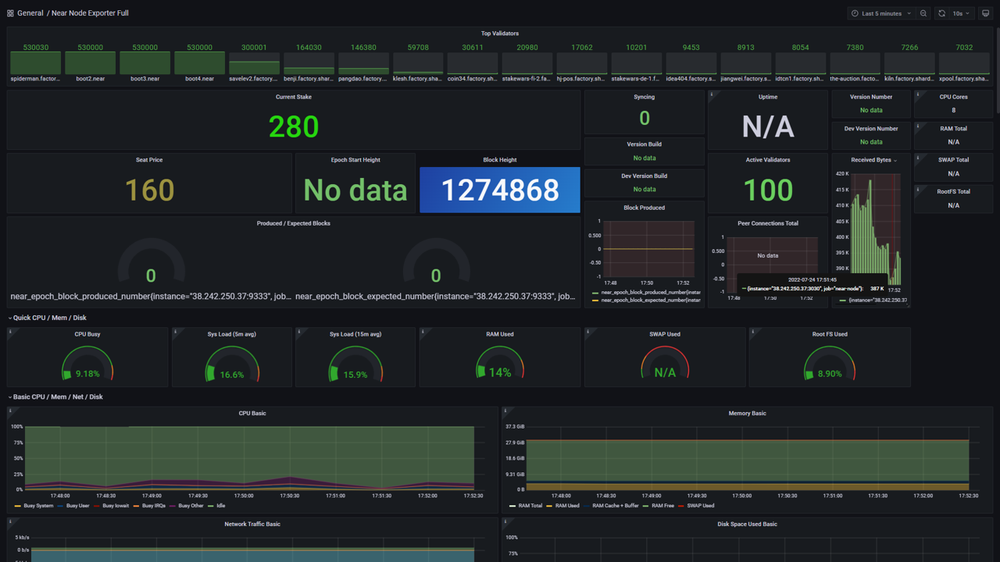

# Email notification

### I've used https://app.smtp2go.com/. You can use any another SMTP service. You have to create SMTP user and sender.

| 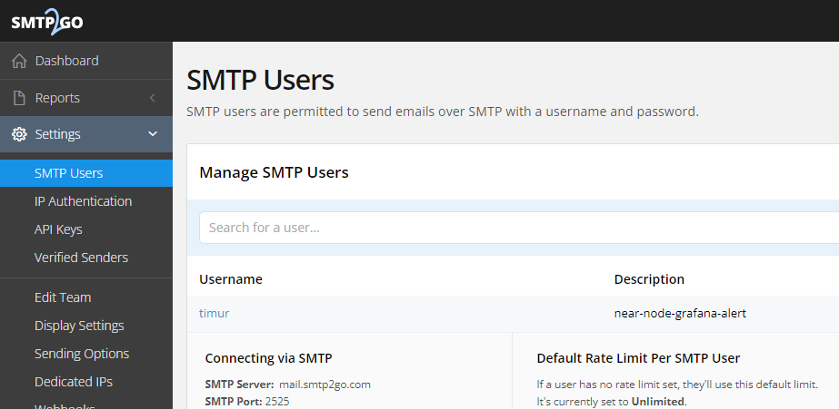 | 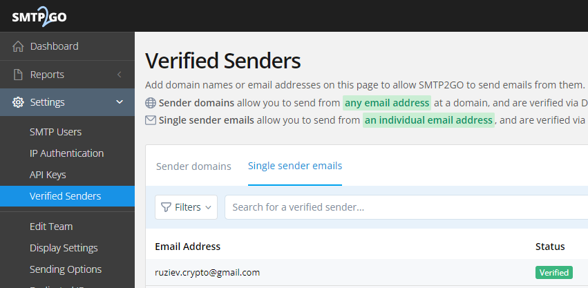 |
| ------------------------------------------ | -------------------------------------------- |

### Then add the information on your grafana/custom.ini file in block [smtp]

```bash
nano ~/near-prometheus-exporter/etc/grafana/custom.ini
```

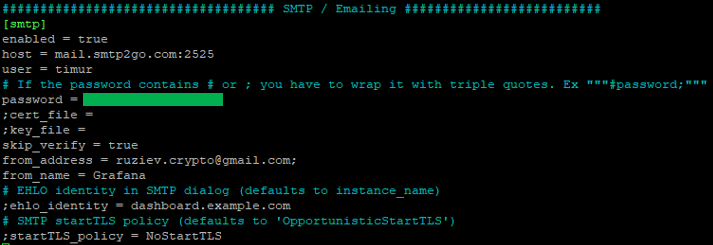

### Restart grafana to apply changes

```bash
sudo docker container restart grafana
```

### Open Grafana -> Alerting -> Concact points

Create new contact point here and send test notification.
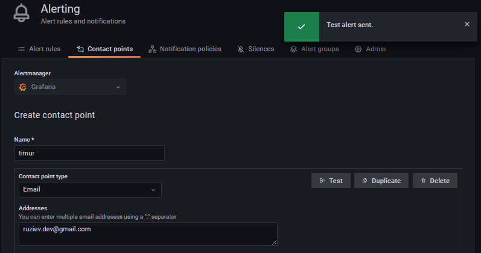

### 🎉 We got test notification on email!

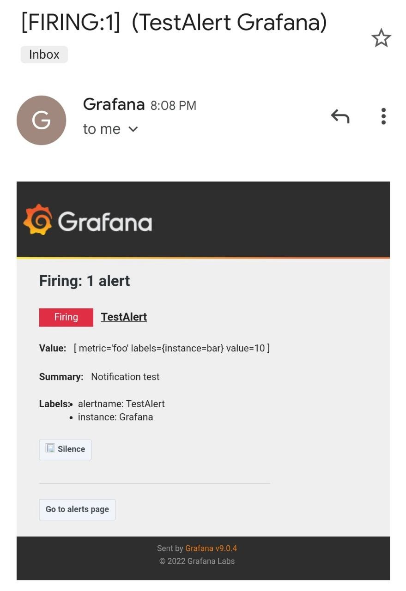

### ❗ To set events which will activate sending messages we have to make settings in Alert rule tab.

# Telegram notifications

I have developed my own script on Node.js, which follow node state and check validator status. My script is placed [**here**](https://github.com/ruziev-dev/near-node-tg-bot)

### Create new bot by writing

Clone repository & install dependencies

```bash
git clone https://github.com/ruziev-dev/near-node-tg-bot.git

cd near-node-tg-bot

npm i
```

Make your `config.env` file by example `.env`

```bash
cp .env config.env
```

Set your settings to `config.env`

```bash
nano config.env

# set your values
TG_API_KEY="5554842487:AAGYMCP*****************"
TG_CHAT_ID="175575260"
NODE_RPC="127.0.0.1:3030"
POOL_ID="timur.factory.shardnet.near"
```

| Value                                                                     | How to get                                  |
| ------------------------------------------------------------------------- | ------------------------------------------- |
| TG_API_KEY - you can get it from [**@BotFather**](https://t.me/BotFather) | 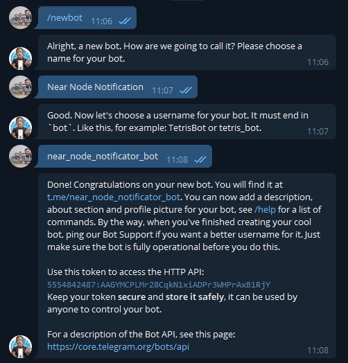 |
| TG_CHAT_ID - you can by using [**@GetIDs Bot**](https://t.me/getidsbot)   | 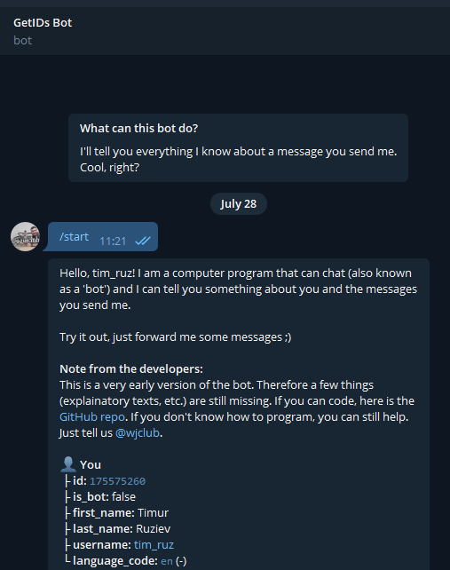  |

### Run Telegram Notificator Script by cron

To run it automatically let's add chron task every minute

```
crontab -e
```

Add this row with setting path to Node.js and script

```bash
# set your path
*/1 * * * * cd /home/timur/near-node-tg-bot/ && /bin/node index.js > /dev/null 2>&1
```

Reload cron service to start execute script

```bash
sudo service cron reload
```

**🥳 Great, we can get messages, from node**

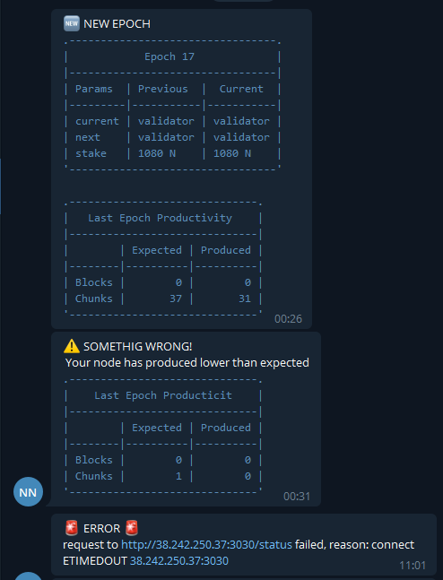

| [⏮ Challenge 003 ](./challenge_003.md) | [Challenge 005 ⏭](./challenge_005.md) |
| -------------------------------------- | ------------------------------------- |
