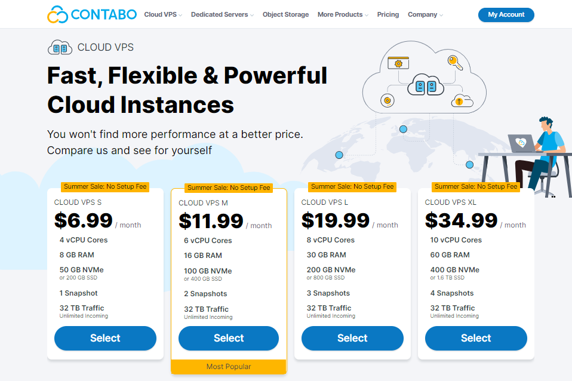
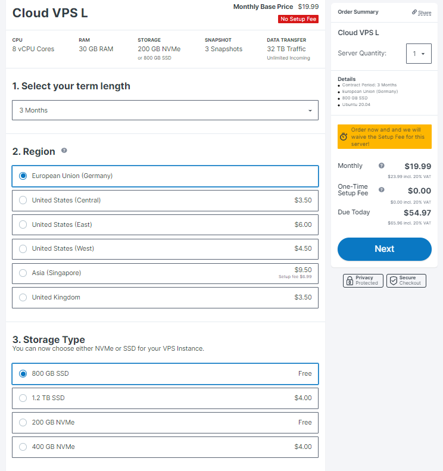
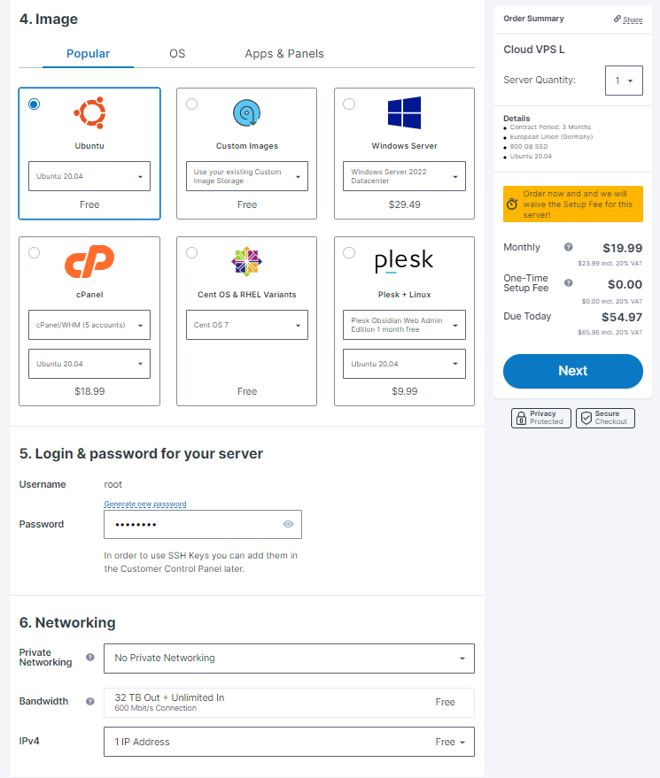
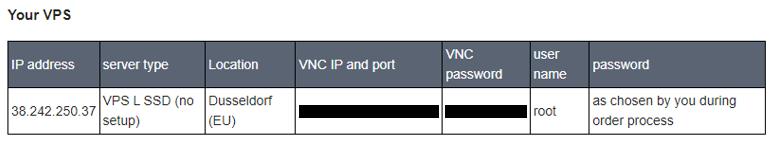
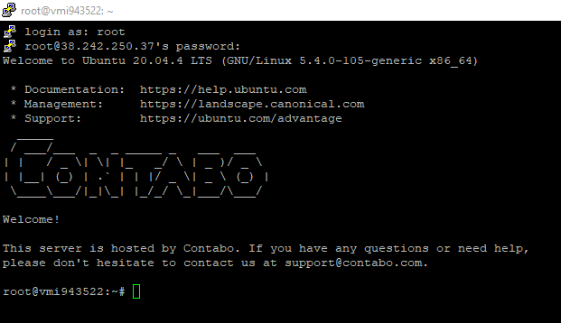

# VPS choice

The best VPS offer I have found is <a href='https://contabo.com/en/vps/'>Contabo</a>

Suitable solution for my requirements is CLOUD VPS L and it's quite powerfull than recommended requirements

| Hardware | Chunk-Only Producer Specifications | Contabo CLOUD VPS L |
| -------- | ---------------------------------- | ------------------- |
| CPU      | 4-Core CPU with AVX support        | 8 vCPU              |
| RAM      | 8GB DDR4                           | 30 GB               |
| Storage  | 500GB SSD                          | 800GB SSD           |

## My configure below

## After payment we will see information to connect to VPS with usig PuTTY connect here by SSH

