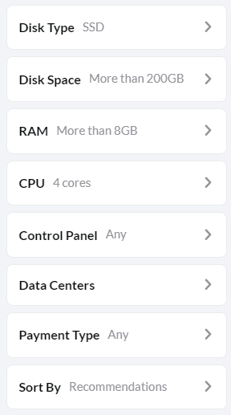

# VPS choice

I have used [HostAdvice](https://hostadvice.com/vps/linux/?disk_space=200-999999999&disk_type=ssd&ram=8192-131072&cpu=4&sort=recommendations) to find suitable VPS solution.

| Filters I used                     | I got                                         |
| ---------------------------------- | --------------------------------------------- |
|  |  |

The best VPS offer I have found is [**Contabo**](https://contabo.com/en/vps/) because it is not only suitable but also it is the cheapest.

Suitable solution for my requirements is CLOUD VPS L and it's quite powerfull than recommended requirements.

| Hardware | Chunk-Only Producer Specifications | Contabo CLOUD VPS L |
| -------- | ---------------------------------- | ------------------- |
| CPU      | 4-Core CPU with AVX support        | 8 vCPU              |
| RAM      | 8GB DDR4                           | 30 GB               |
| Storage  | 500GB SSD                          | 800GB SSD           |


## My configure below


## Total payment

My total payment was 66 USD per 3 months. It's 22 USD/month and it's the best cost with my VPS configure.


## After payment we will see information to connect to VPS with usig PuTTY connect here by SSH


# Creating new user

### To avoid security problems we have to create user who won't super-user by default

```bash
useradd -m timur
passwd timur
> New password: # enter password
> Retype new password: # repeat password
> passwd: password updated successfully

usermod -s /bin/bash timur
sudo adduser timur sudo
> Adding user timur to group sudo ...
> Adding user timur to group sudo
> Done.
```

| [⏮ Challenge 004 ](./challenge_004.md) | [Challenge 005 ⏭](./challenge_005.md) |
| -------------------------------------- | ------------------------------------- |
