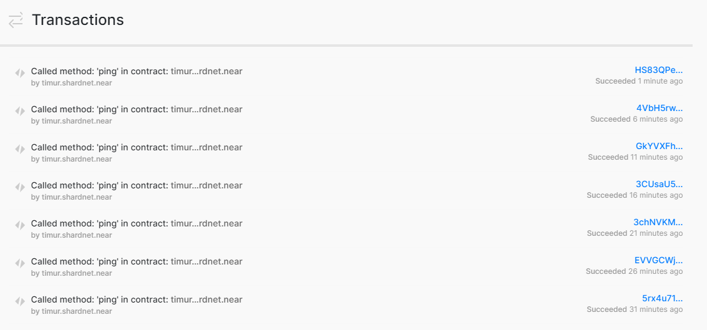

# Automate ping the network by crontab

### Create script:

Create a new file on /home/timur/scripts/ping.sh

```bash

# folder for future automation logs
mkdir logs

# folder for automation scripts
mkdir scripts

nano /home/timur/scripts/ping.sh
```

Paste:

```bash
#!/bin/sh
# Ping call to renew Proposal added to crontab

export NEAR_ENV=shardnet

#export LOGS=/home/<USER_ID>/logs
export LOGS=/home/timur/logs

#export POOLID=<YOUR_POOL_ID>
export POOLID=timur

#export ACCOUNTID=<YOUR_ACCOUNT_ID>
export ACCOUNTID=timur

echo "---" >> $LOGS/all.log
date >> $LOGS/all.log
near call $POOLID.factory.shardnet.near ping '{}' --accountId $ACCOUNTID.shardnet.near --gas=300000000000000 >> $LOGS/all.log
near proposals | grep $POOLID >> $LOGS/all.log
near validators current | grep $POOLID >> $LOGS/all.log
near validators next | grep $POOLID >> $LOGS/all.log
```

### Create a new crontab, running every 5 minutes:

```bash
crontab -e

```

Add new row into end of openned file and close it

```bash
*/5 * * * * sh /home/timur/scripts/ping.sh
```

List crontab to see it is running:

```bash
crontab -l

> # m h  dom mon dow   command
> */5 * * * * sh /home/timur/scripts/ping.sh
```

<div style="text-align:center">
	
</div>
Review your logs:

```bash
cat ~/logs/all.log

# result
Sat 23 Jul 2022 10:50:01 PM CEST
Scheduling a call: timur.factory.shardnet.near.ping({})
Doing account.functionCall()
Transaction Id 3CUsaU5DjQigVKbmZh7NCioDKvTRBk1geXNetWuZ5ehs
To see the transaction in the transaction explorer, please open this url in your browser
https://explorer.shardnet.near.org/transactions/3CUsaU5DjQigVKbmZh7NCioDKvTRBk1geXNetWuZ5ehs
''
| Proposal(Accepted) | timur.factory.shardnet.near                 | 280 => 280         | 1       |
| timur.factory.shardnet.near                 | 280     | 1       | 100%     |               0 |               0 |               2 |               2 |
| Rewarded   | timur.factory.shardnet.near                 | 280 -> 280         | 1       |
---
Sat 23 Jul 2022 10:55:01 PM CEST
Scheduling a call: timur.factory.shardnet.near.ping({})
Doing account.functionCall()
Transaction Id GkYVXFhnBgDLmrgK5dhrcDWHRBN6og8N8uxkb8hYVUBu
To see the transaction in the transaction explorer, please open this url in your browser
https://explorer.shardnet.near.org/transactions/GkYVXFhnBgDLmrgK5dhrcDWHRBN6og8N8uxkb8hYVUBu
''
| Proposal(Accepted) | timur.factory.shardnet.near                 | 280 => 280         | 1       |
| timur.factory.shardnet.near                 | 280     | 1       | 100%     |               0 |               0 |               2 |               2 |
| Rewarded   | timur.factory.shardnet.near                 | 280 -> 280         | 1       |
---
Sat 23 Jul 2022 11:00:01 PM CEST
Scheduling a call: timur.factory.shardnet.near.ping({})
Doing account.functionCall()
Transaction Id 4VbH5rwtvhFpBTWiA7n4n7x1peU7cmXT1PWitDfp9vUE
To see the transaction in the transaction explorer, please open this url in your browser
https://explorer.shardnet.near.org/transactions/4VbH5rwtvhFpBTWiA7n4n7x1peU7cmXT1PWitDfp9vUE
''
| Proposal(Accepted) | timur.factory.shardnet.near                 | 280 => 280         | 1       |
| timur.factory.shardnet.near                 | 280     | 1       | 100%     |               0 |               0 |               2 |               2 |
| Rewarded   | timur.factory.shardnet.near                 | 280 -> 280         | 1       |
```



| [⏮ Challenge 005 ](./challenge_005.md) | <!-- [Challenge 007 ⏭](./challenge_007.md) --> |
| -------------------------------------- | ---------------------------------------------- |
