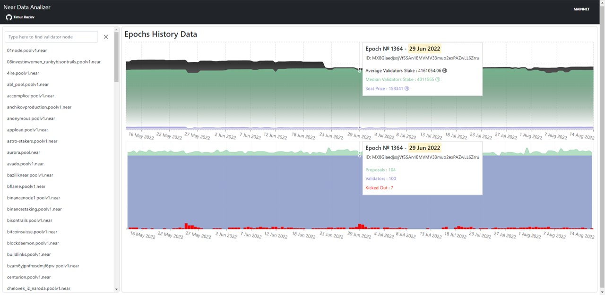

# Data analyzing

## Source List

To improove my understanding of Near protocol I have used sources below:

- https://nomicon.io/
- https://near-indexers.io/

To read data from blockchain I used docks from https://docs.near.org/api/rpc/introduction

## Research Goals

- See historical validators productivity;
- See historical kicking out for each validators;
- See historical data about validator stake;
- Find difference between median and average stake;
- Find depencies between validator stake and quantity of produced blocks and chunks;
- TODO: Find validators rewards.

## Technical Implementation

To grab data I have developed [**small backend**](https://github.com/ruziev-dev/near-data-analyze) service which includes 2 small microsevices:

- Data grabber which writes data to SQLite database;
- Http-server to get data by REST API.

I deployed it here: TODO: add link to server with backend

### Screenshots of essential tables from SQLite DB below:

My backend endpoints API you can see in [**repository**](https://github.com/ruziev-dev/near-data-analyze)

## Dashboard

I've created frontend service to show graphics.
You can see it in interactive mode here: https://ruziev-dev.github.com/near-data-analyze-frontend

### It includes 3 views:

### 1. Epoch history info shows:

- Historical kicking out in epoch;
- Seat price history graphic;
- Median and average stake in each epoch and difference between them.
- Total validators quantity.

### 2. Pool history info

- Historical pool productivity;
- Historical validator stake;
- Historical data about uptime and kicking out;

### 3. Epoch pools productivity

- Dependency between validator stake and quantity of produced blocks and chunks;

## TODO: solve next unresolved problems:

1. Get rewards per epoch dependencie
2. Solve how to get info lower epoch 1289 (problem block 65505088)
3. Deploy it

| [⏮ Challenge 006 ](./challenge_006.md) | [Challenge 008 ⏭](./challenge_008.md) |
| -------------------------------------- | ------------------------------------- |
