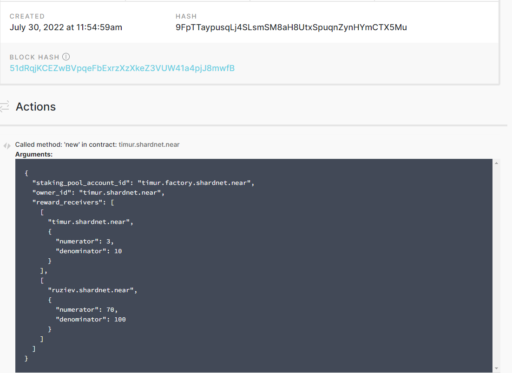
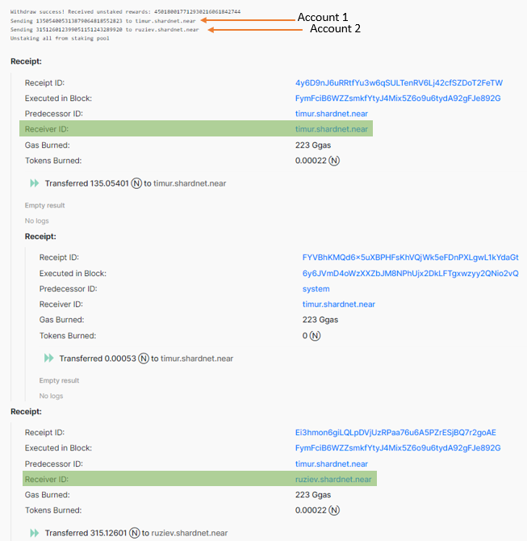

# Split revenue for staking rewards

## Prepare environment

We have intalled Rust and Cargo on [Challenge 002](./challenge_002.md), you can check it

```bash
rustup -V
# result
> rustup 1.25.1 (bb60b1e89 2022-07-12)

cargo -V
# result
> cargo 1.62.1 (a748cf5a3 2022-06-08)
```

If you did'n t get similar result install Rust compiler:

> 1. Run command:
>
> ```bash
> curl --proto '=https' --tlsv1.2 https://sh.rustup.rs -sSf | sh
> ```
>
> 2. When installiation programm ask you choose settings press 1 and press enter.
>    Wait some time and see:
>
> > Rust is installed now. Great!
>
> 3. Run command:
>
> ```bash
> source $HOME/.cargo/env
> ```

Add the wasm32-unknown-unknown toolchain

```bash
rustup target add wasm32-unknown-unknown
```

Check installation:

```bash
rustup target list | grep wasm32-unknown-unknown

# result
> wasm32-unknown-unknown (installed)
```

## Deploy smart contract

Clone the project found [here](https://github.com/zavodil/near-staking-pool-owner)

```bash
git clone https://github.com/zavodil/near-staking-pool-owner
```

Compile smart contract

```bash
cd near-staking-pool-owner/contract
cargo build --target wasm32-unknown-unknown --release
```

Deploy smart contract on your owner account. Adjust the path to .wasm file if required.

```bash
NEAR_ENV=shardnet near deploy timur.shardnet.near --wasmFile target/wasm32-unknown-unknown/release/contract.wasm
```

We have to see message like below:

```
> Starting deployment. Account id: timur.shardnet.near, node: https://rpc.shardnet.near.org, helper: https://helper.shardnet.near.org, file: target/wasm32-unknown-unknown/release/contract.wasm
> Retrying request to broadcast_tx_commit as it has timed out ....
> Transaction Id EXq9PUaehLbs6cqHFVjMgk37PsY2kupWQsn97H4wsVmR
> To see the transaction in the transaction explorer, please open this url in your browser
> https://explorer.shardnet.near.org/transactions/EXq9PUaehLbs6cqHFVjMgk37PsY2kupWQsn97H4wsVmR
> Done deploying to timur.shardnet.near

```

Initialize the smart contract picking accounts for splitting revenue.

```bash
CONTRACT_ID=timur.shardnet.near


# Change numerator and denomitor to adjust the % for split.
# NEAR_ENV=shardnet near call $CONTRACT_ID new '{"staking_pool_account_id": "<STAKINGPOOL_ID>.factory.shardnet.near", "owner_id":"<OWNER_ID>.shardnet.near", "reward_receivers": [["<SPLITED_ACCOUNT_ID_1>.shardnet.near", {"numerator": 3, "denominator":10}], ["<SPLITED_ACCOUNT_ID_2>.shardnet.near", {"numerator": 70, "denominator":100}]]}' --accountId $CONTRACT_ID

NEAR_ENV=shardnet near call $CONTRACT_ID new '{"staking_pool_account_id": "timur.factory.shardnet.near", "owner_id":"timur.shardnet.near", "reward_receivers": [["timur.shardnet.near", {"numerator": 3, "denominator":10}], ["ruziev.shardnet.near", {"numerator": 70, "denominator":100}]]}' --accountId $CONTRACT_ID
```

```
> Doing account.functionCall()
> Retrying request to broadcast_tx_commit as it has timed out [""]
> Transaction Id 9FpTTaypusqLj4SLsmSM8aH8UtxSpuqnZynHYmCTX5Mu
> To see the transaction in the transaction explorer, please open this url in your browser
> https://explorer.shardnet.near.org/transactions/9FpTTaypusqLj4SLsmSM8aH8UtxSpuqnZynHYmCTX5Mu
```



Wait until you start receiving rewards on your node staking pool. Do a withdraw of rewards.

```bash
near call timur.shardnet.near withdraw '{}' --accountId timur.shardnet.near --gas 200000000000000
```

```
Receipts: AU3YfjaNnk9nXGvPrXsCpGimLu8fX1Ve5f35dYJrGZZJ, 6GUVPaz9p6PxfbeU195R2C5ANu71b2t8dDtaYSKRa6pD, 44sC2BwwdSvqs8pvdCuAGfPFhBjYfiuXqykE2Jr4Fkhv
        Log [timur.shardnet.near]: Withdrawing from staking pool: 450180017712930216061842744
Receipts: GFN4YVBKQMpYLCTjZNnuWJTzvjqrRUSeDP5eD5VGUzsN, 4iYGRXygCGwAmJvcH1YJqbdUZUDUNdBFELCdSCfxAoAe
        Log [timur.shardnet.near]: @timur.shardnet.near withdrawing 450180017712930216061842744. New unstaked balance is 0
Receipts: 4y6D9nJ6uRRtfYu3w6qSULTenRV6Lj42cfSZDoT2FeTW, Ei3hmon6giLQLpDVjUzRPaa76u6A5PZrESjBQ7r2goAE, FmSSD9bTgM1rXDFfCJHyhMmiDtRzmvo7jmwHKnRCCev9, CucmE1zkSBSGmJnrMcXVBydtNnKUkfwTtjEKKuub5rcw
        Log [timur.shardnet.near]: Withdraw success! Received unstaked rewards: 450180017712930216061842744
        Log [timur.shardnet.near]: Sending 135054005313879064818552823 to timur.shardnet.near
        Log [timur.shardnet.near]: Sending 315126012399051151243289920 to ruziev.shardnet.near
        Log [timur.shardnet.near]: Unstaking all from staking pool
Receipts: bxQXbToPs7W2vV7ouhUCDXLnaWqqz7BWr5QLEMKi5k7, GudWFBiGi4seGGCfHdBVfoxvRvQTF4fu2SegrEdsk8K2, 32nkJ2M3UdRT4XeFJ1wftpZdiRJHn4kbU72Wzi2wwHbm
        Log [timur.shardnet.near]: @timur.shardnet.near unstaking 50007584509714681253327988. Spent 49981145396150705360061714 staking shares. Total 50007584509714681253327988 unstaked balance and 0 staking shares
        Log [timur.shardnet.near]: Contract total staked balance is 1030233011659610758009064898. Total number of shares 1029688325331333216522775209
Transaction Id 8gGhSi7FMcptYFmNGUA5FjHEhwb3e7SynFbNHsRgoScP
To see the transaction in the transaction explorer, please open this url in your browser
https://explorer.shardnet.near.org/transactions/8gGhSi7FMcptYFmNGUA5FjHEhwb3e7SynFbNHsRgoScP
''
```

[**Link to transaction in Explorer**](https://explorer.shardnet.near.org/transactions/8gGhSi7FMcptYFmNGUA5FjHEhwb3e7SynFbNHsRgoScP)



| [⏮ Challenge 007 ](./challenge_007.md) | [Challenge 009 ⏭](./challenge_009.md) |
| -------------------------------------- | ------------------------------------- |
