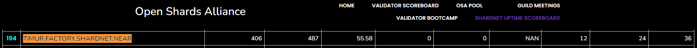
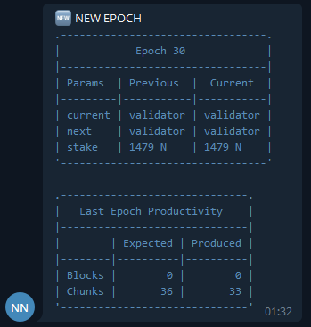
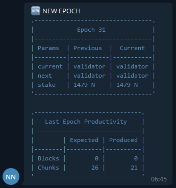
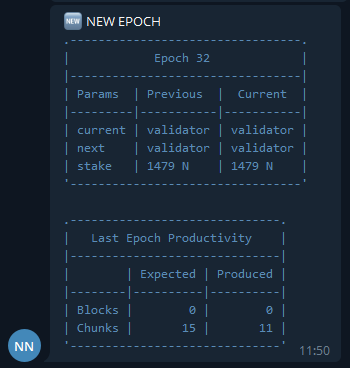
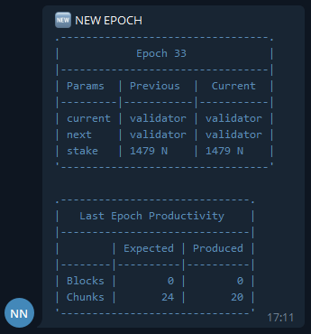
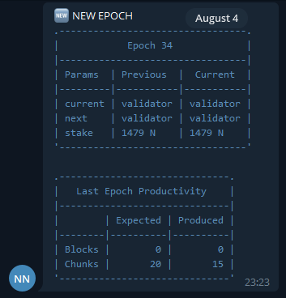

# Uptime monitoring

## Open Port 3030 for Diagnostic reporting

We have intalled Rust and Cargo on [Challenge 002](./challenge_002.md), you can check it

```bash
sudo iptables -L | grep 3030
# my result
> ACCEPT     tcp  --  anywhere             anywhere             tcp dpt:3030
```

If you didn't get answer like me. You have to open port

```bash
sudo iptables -A INPUT -p tcp --dport 3030 -j ACCEPT
```

Save the config for server restarts

You can use one of the 2 solutions:

- Using iptables-persistent

```bash
sudo apt install iptables-persistent
```

- or if already installed

```bash
sudo dpkg-reconfigure iptables-persistent
```

Save config

```bash
iptables-save > /etc/iptables/rules.v4
ip6tables-save > /etc/iptables/rules.v6
```

## Validate the port is open

You can create request to http://<YOUR IP>:3030/status by your browser or Postman, and see information like this:


## Strict report:

- Link to my node: http://65.109.30.186:3030/status
- Upteme screenshot from [**openshards.io**](https://openshards.io/shardnet-uptime-scoreboard/) you can see in table below\*

<b>\*</b> There were lots of techicahal network problems. Few hardforks and network stucking doesn't influence positive on uptime percentage. I have missed 12 epochs because of problems.

| **INFO**                    | **SCREENSHOT**                                                   |
| --------------------------- | ---------------------------------------------------------------- |
| August 5 <br><br> **55,3%** |  |
| August 6 <br><br> **55,6%** |  |

## My uptime report

In general when network was working without any problems I got productivity **> 70%**,
I've created script which notify me by Telegram each new epoch. I got reports below.

| Epoch Percentage | Notification from my Telegram bot                               |
| ---------------- | --------------------------------------------------------------- |
| **91,7%**        |  |
| **80,8%**        |  |
| **73,3%**        |  |
| **83,3%**        |  |
| **75,0%**        |  |

| [⏮ Challenge 008 ](./challenge_008.md) | <!--  [Challenge 010 ⏭](./challenge_010.md) --> |
| -------------------------------------- | ----------------------------------------------- |
