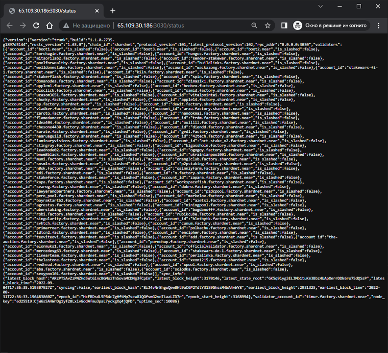
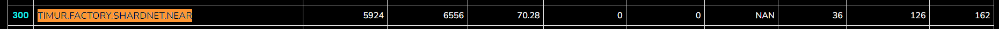

# Uptime monitoring

## Open Port 3030 for Diagnostic reporting

```bash
sudo iptables -L | grep 3030
# my result
> ACCEPT     tcp  --  anywhere             anywhere             tcp dpt:3030
```

If you didn't get answer like me. You have to open port

```bash
sudo iptables -A INPUT -p tcp --dport 3030 -j ACCEPT
```

Save the config for server restarts

You can use one of the 2 solutions:

- Using iptables-persistent

```bash
sudo apt install iptables-persistent
```

- or if already installed

```bash
sudo dpkg-reconfigure iptables-persistent
```

Save config

```bash
iptables-save > /etc/iptables/rules.v4
ip6tables-save > /etc/iptables/rules.v6
```

### Validate the port is open

You can create request to http://<YOUR IP>:3030/status by your browser or Postman, and see information like this:



## Report:

- Link to my node: http://65.109.30.186:3030/status
- Uptime screenshot from [**openshards.io**](https://openshards.io/shardnet-uptime-scoreboard/) actual on the 4 of September you can see in picture below



| [⏮ Challenge 008 ](./challenge_008.md) | [Challenge 011 ⏭](./challenge_011.md) |
| -------------------------------------- | ------------------------------------- |
