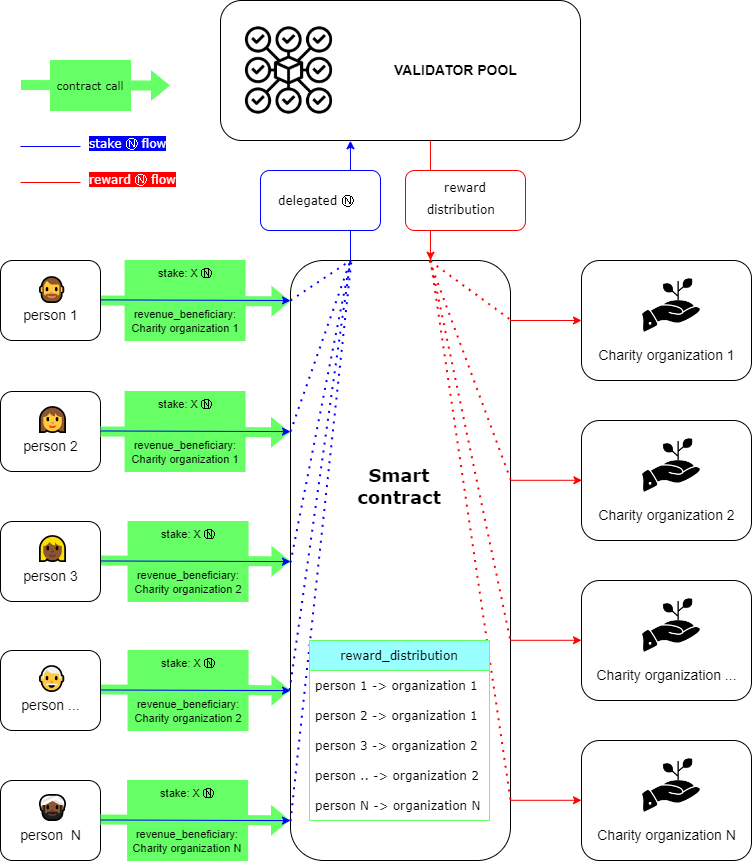
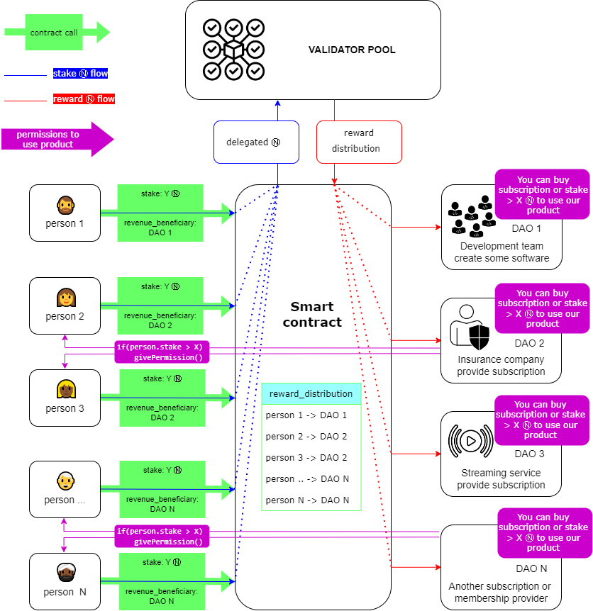

# Staking Farm

## Current staking approach

The traditional staking scheme looks like a traditional bank deposit. You can hold tokens and get revenue.

Now NEAR offers a stake farming scheme. It gives the opportunity to stake your tokens and get some other value for staking. They are tokens of ecosystem projects.
Stake farming generates much higher APY, incentivizes more network usage, and reduced perceived inflation of the base token;

But stake farming has some disadvantages:

- Each ecosystem project has to have its own validator node;
- Each node has to get enough delegations to accumulate seat price;
- Delegators get tokens of another project and they forsed to think how to use the new tokens and how to change it on some service? 🤷‍♂️

## My ideas

### 1. Charity Staking

Lots of people want to can we connect it with staking?

First solution which we can imagine: Each charity project/organization have to set up ther own node, get enough stake to satisfy seat price and deploy a smart-contract like that we deployed in [Challenge 008](./challenge_008.md).

**😞 But it too difficult and almost impossible!**

I offer a solution which can be controlled by smart contract (see picture below).

Person who has Near tokens can stake it via smart contract which accumulates delegations from some accounts to one validator and redirects staking reward to some organizations which person choose.

Advantages:

- people can hold tokens and use them for good deed;
- charity organizations don't have to face difficulties to up their node and accumulate seat price.

P.S. Currently some countries have tax breaks for people and organizations which take part in some charity oranization.
In future when criptosphere will be approved, connected and regulated by goverment services data of such contract would be proof of charity using to get tax breaks.

### 2. Membership/subscription

The scheme is the same as above. Some organization/DAO who provide subscription or membership can make offer:

> You can buy a subscription on our service (traditional way) or also you can stake X Ⓝ with reward distribution in our favour.

Smart contract stores data about users who stake tokens, stake amount and revenue beneficiary organization. When user try to apply to service business logic of service can check value of user stake. If there is enough user stake service can give permission to user to some functions.

Advantages:

- Such approach allows organizations to use difficult subscriptions plan (like base, advanced, pro) without any difficult payment services;
- People can hold tokens and use it to subscribe on some services without spending their tokens;
- Organizations can attract users who hold tokens to their products.

### Conclusion

Near ecosystem users can get some products or take part in sponsorship of some events without spending body of theirs deposit.

You can hold values and use some services without real value spending!

P.S: If I had more time to implement smart account I would try to do it but unfortunately, I don't have enough time now.

| [⏮ Challenge 009 ](./challenge_009.md) | [Challenge 013 ⏭](./challenge_013.md) |
| -------------------------------------- | ------------------------------------- |
