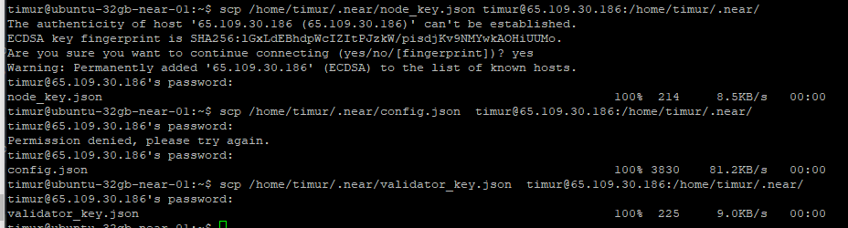
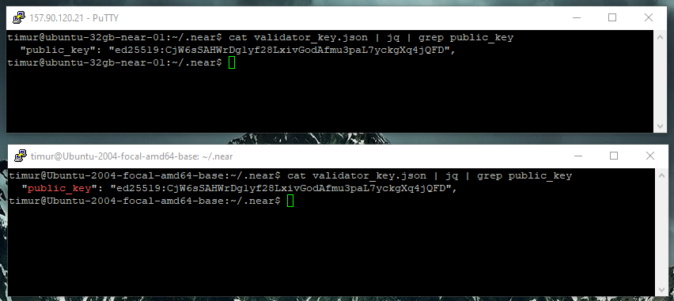
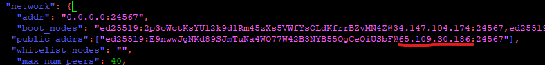

# Backup node

## Preparing new host

It's great task because I lost lots of chunks and missed too much epochs on some technical problems with network and also I my choise of Contabo VPS was a mistake.
I had to move to another service. For prepairing I have completed next steps:

1. [Challenge 001 - Deployment NEAR CLI](./challenge_001.md#deployment-near-cli)
2. [Challenge 002 - Deployment a node](./challenge_002.md#deployment-a-node)
3. [Challenge 002 - Downloading a snapshot](./challenge_002.md#downloading-a-snapshot)
4. [Challenge 002 - Setting neard as system service](./challenge_002.md#setting-neard-as-system-service)

Then I waited downloading previous blocks data and I have used `scp` util to transmit data over SSH connection between hosts.

## Keys transmitting

```bash
scp /home/timur/.near/validator_key.json  timur@65.109.30.186:/home/timur/.near/

scp /home/timur/.near/node_key.json timur@65.109.30.186:/home/timur/.near/

scp /home/timur/.near/config.json  timur@65.109.30.186:/home/timur/.near/
```



Compare it and see that they are equal 😎

```bash
cat validator_key.json | jq | grep public_key
```



Update IP adress in `config.json`

```bash
nano config.json
```



### **Important ❗** Remove or chande name for files `validator_key.json` and `node_key.json` on old host

```bash
mv validator_key.json _validator_key.json

mv node_key.json _node_key.json

ls
> config.json  data  genesis.json  _node_key.json  _validator_key.json
```

### **Important ❗** First You must stop neard daemon on old host then you can restart your daemon on new host with new keys

1. Stop daemon neard on old host

```bash
sudo systemctl stop neard
```

2. Restart on new host

```bash
sudo systemctl restart neard
```

| [⏮ Challenge 011 ](./challenge_011.md) | [Challenge 014 ⏭](./challenge_014.md) |
| -------------------------------------- | ------------------------------------- |
