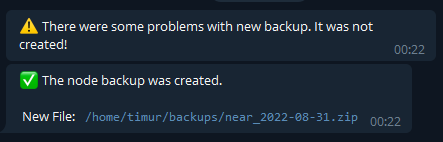

# Auto-backup node script

Create new script file in script directory

```bash
sudo apt install moreutils zip

cd scripts

nano autobackup.sh
```

```bash
#!/bin/bash

DATE=$(date +%Y-%m-%d)
DATADIR=/home/timur/.near
BACKUPS_DIR=/home/timur/backups
BACKUP_DATA=${BACKUPS_DIR}/near_${DATE}
SERVICE_NEAR_NAME=neard.service

TELEGRAM_BOT_TOKEN="YOUR TELEGRAM BOT TOKEN"
CHAT_ID="YOUR CHAT ID"
TG_URL=https://api.telegram.org/bot$TELEGRAM_BOT_TOKEN/sendMessage

NEW_BACKUP_FILE=$BACKUP_DATA.zip

# create dir if not exists
if [ ! -d "$BACKUPS_DIR" ]; then
  echo "Create directory $BACKUPS_DIR" | ts
  mkdir $BACKUPS_DIR
fi


# delete old backup
OLD_BACKUPS=`ls $BACKUPS_DIR/*.zip`
for file in $OLD_BACKUPS
  do
     rm $file
     if [ ! -d "$file" ]; then
       echo "$file has been deleted" | ts
     fi
  done


sudo systemctl stop $SERVICE_NEAR_NAME
wait


echo "New backup started" | ts

zip -r $BACKUP_DATA $DATADIR

echo "Backup completed" | ts

sudo systemctl start $SERVICE_NEAR_NAME


# check file and notify by Telegram
if [ -f $NEW_BACKUP_FILE ]; then
   curl -s -X POST $TG_URL -d chat_id=$CHAT_ID -d parse_mode=markdown \
         -d text="✅ The node backup was created. New File: $NEW_BACKUP_FILE "
else
   curl -s -X POST $TG_URL -d chat_id=$CHAT_ID -d text="⚠️ There were some problems with new backup. It was not created!"
fi

```

Add exacutable permissions

```bash
chmod +x autobackup.sh
```

To check script lets run it

```bash
sudo ./scripts/autobackup.sh
```

```bash
Aug 31 21:24:48 /home/timur/backups/near_2022-08-31.zip has been deleted
Aug 31 21:24:52 New backup started
  adding: home/timur/.near/ (stored 0%)
  adding: home/timur/.near/config.json (deflated 65%)
  adding: home/timur/.near/genesis.json (deflated 70%)
  adding: home/timur/.near/validator_key.json (deflated 12%)
  adding: home/timur/.near/data/ (stored 0%)
  adding: home/timur/.near/data/370228.sst (deflated 0%)
  adding: home/timur/.near/data/365638.sst (deflated 0%)
  adding: home/timur/.near/data/597868.sst (deflated 0%)
  adding: home/timur/.near/data/220393.sst (deflated 0%)
  adding: home/timur/.near/data/416399.sst (deflated 3%)
  adding: home/timur/.near/data/297108.sst (deflated 0%)
  adding: home/timur/.near/data/384199.sst (deflated 0%)
  adding: home/timur/.near/data/643905.sst (deflated 1%)
  adding: home/timur/.near/data/315541.sst (deflated 0%)
  adding: home/timur/.near/data/431833.sst (deflated 13%)
  .....
  .....


Aug 31 21:46:13 Backup completed

```

For automatic start add task to crontab:

```bash
sudo nano /etc/crontab
```

```bash
# Example of job definition:
# .---------------- minute (0 - 59)
# |  .------------- hour (0 - 23)
# |  |  .---------- day of month (1 - 31)
# |  |  |  .------- month (1 - 12) OR jan,feb,mar,apr ...
# |  |  |  |  .---- day of week (0 - 6) (Sunday=0 or 7) OR sun,mon,tue,wed,thu,fri,sat
# |  |  |  |  |
# *  *  *  *  * user-name command to be executed
0 12 *  *  *  timur   /home/timur/scripts/autobackup.sh >> /home/timur/logs/backup.log 2>&1
```

In script conclusion it notifies pool owner by Telegram with messages like below:



| [⏮ Challenge 013 ](./challenge_013.md) | [Challenge 016 ⏭](./challenge_016.md) |
| -------------------------------------- | ------------------------------------- |
