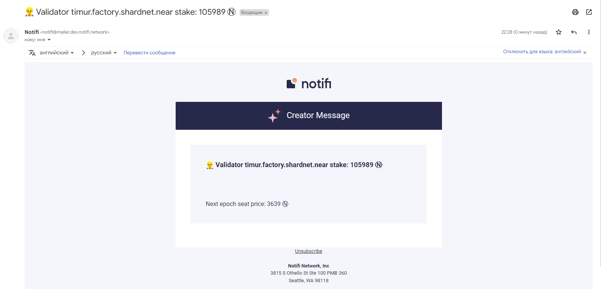

# Connect a node validator for sending notifications through Notifi

## Getting credentials

I got credentials on my e-mail on the second day after completeng form by link shared [#integration-requests](https://discord.com/invite/nAqR3mk3rv) in Discord channel.


To complete the task I have created Node.js script and shared it in repository: https://github.com/ruziev-dev/notifi-near-integration

## Apply script

```bash
git clone https://github.com/ruziev-dev/notifi-near-integration.git

cd notifi-near-integration

npm i
```

Create `.env` file by example `example.env` and set credentials

```bash
cp example.env .env

nano .env
```

```bash
POOL_ID="timur.factory.shardnet.near"
NODE_IP=127.0.0.1
SID=******************************
SECRET='****************************************'
TOPIC=*******************************
```

```bash
npm run build
```

```bash
node build/index.js
```

Everething is ok I got e-mail message



## Add task by crontab

```bash
which node

# use this path to in crontask
> /usr/bin/node

```

Add chron task midnight

```
crontab -e
```

Add this row with setting path to Node.js and script

```bash
0 0 * * * cd /home/timur/notifi-near-integration && /usr/bin/node build/index.js > /dev/null 2>&1
```

| [⏮ Challenge 014 ](./challenge_014.md) | <!--  [Challenge 015 ⏭](./challenge_015.md) --> |
| -------------------------------------- | ----------------------------------------------- |
