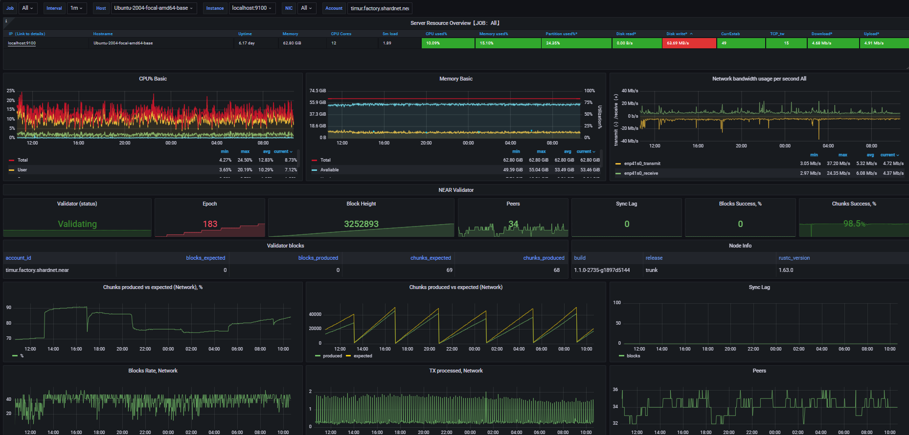

# Graffana Dashboard

I have deployed Graffana dashboard in [Challenge 004](./challenge_004.md#node-monitoring)

But after moving to new server I didn't deploy it.
So I'm creating it again.

There is great tool to deploy Graffana and Prometeus which was created by another Stakewars participant.
I have used this installer tool.

```bash
wget -q -O near-stakewars-monitoring-installer.sh https://raw.githubusercontent.com/davaymne/near-stakewars-monitoring/main/near-stakewars-monitoring-installer.sh && chmod +x near-stakewars-monitoring-installer.sh && sudo /bin/bash near-stakewars-monitoring-installer.sh
```

After succesfull installation I have seen message

```bash
------------------------------------
To open grafana, run http://65.109.30.186:3000
User: admin, Pass: admin
------------------------------------
```

After opening http://65.109.30.186:3000 and login default auth data, I have changed password.
After that I have seen such dashboard:



| [⏮ Challenge 016 ](./challenge_016.md) | [Challenge 020 ⏭](./challenge_020.md) |
| -------------------------------------- | ------------------------------------- |
