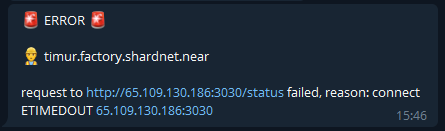
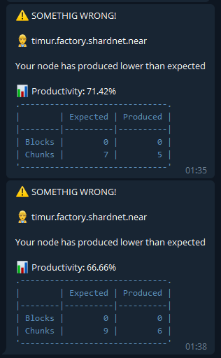
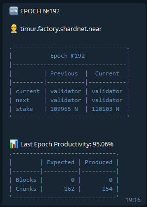

# Telegram Bot Script

I have created my own [**Telegram Bot Script**](https://github.com/ruziev-dev/near-node-tg-bot) when I completed [Challenge 004](./challenge_004.md#node-monitoring). After that I have read some positive feedback from another Stakewars participants and some of them offered me some improvements.

Examples of notifications you can see below:

1. When there is some connection error or neard had stopped

2. When uptime lower 80% and goes down

3. When new epoch was started

[⏮ Challenge 019 ](./challenge_019.md)
